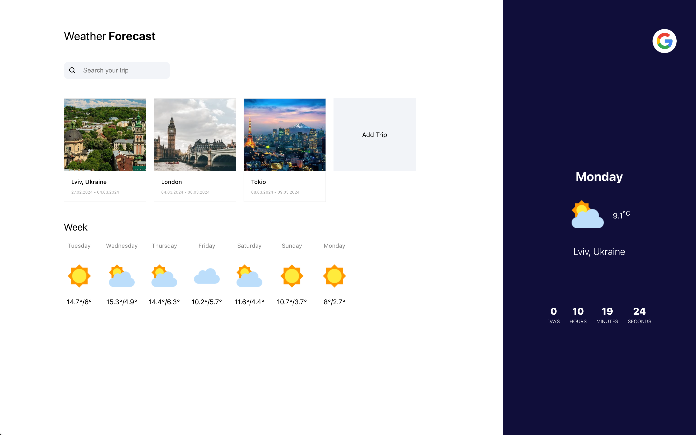
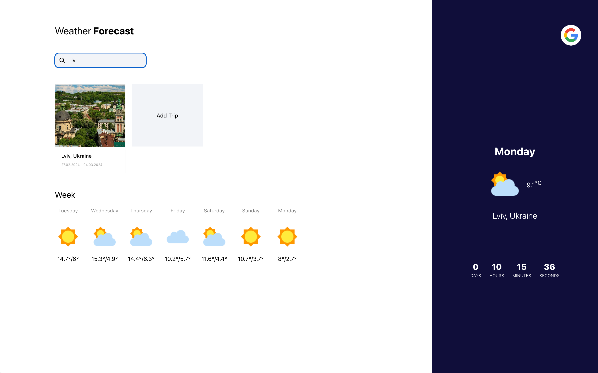
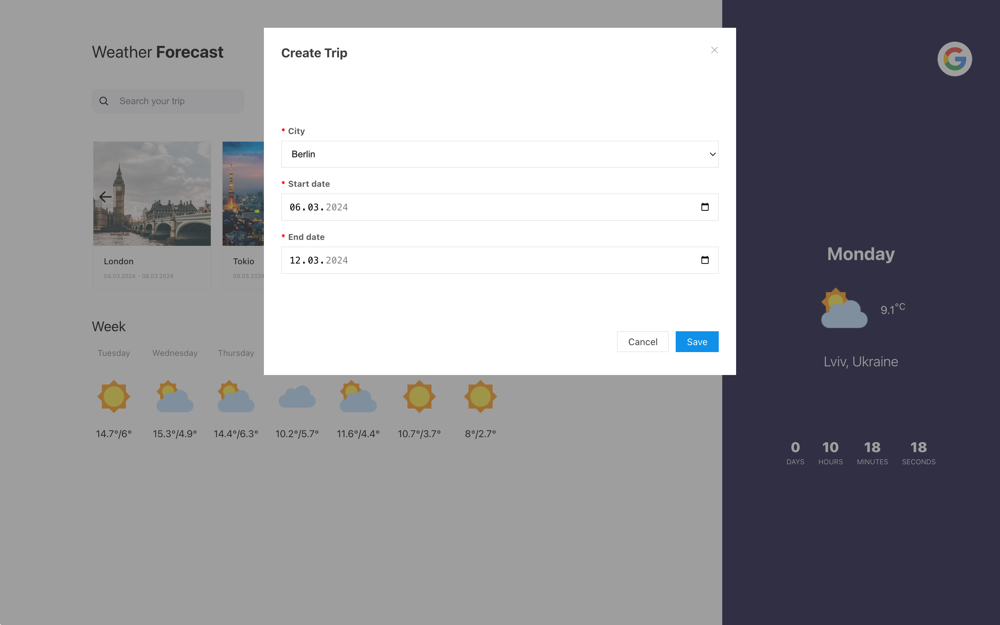
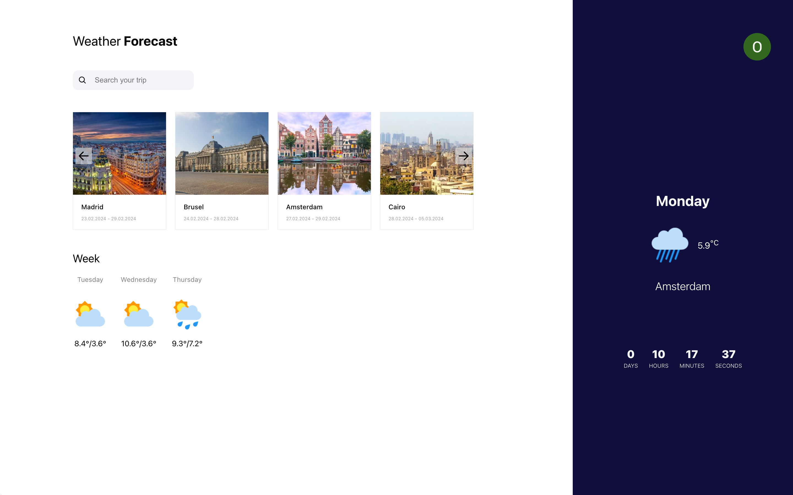
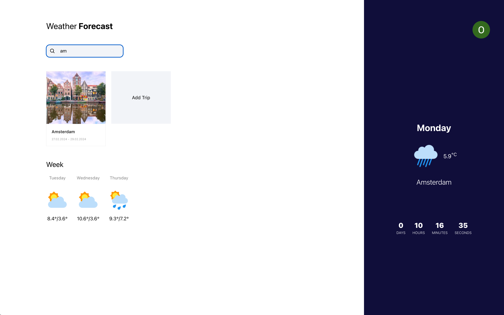

## App description

This app streamlines the process of organizing travel plans, offering a straightforward interface for users to view their scheduled trips. Each trip is prominently displayed with a countdown to its commencement and the weather forecast for the current day. By selecting a trip, users can delve into a detailed weather forecast for every day of their journey. Adding new trips is made efficient through a modal window, allowing users to pick a city from a predefined list, set the start and end dates within the next 15 days, and seamlessly integrate it into their itinerary. The app enhances user engagement with features like intuitive navigation controls and the option to log in with Google account for a personalized experience. All trips are sorted by start trip date. 

The application delivers accurate weather predictions thanks to the Visual Crossing Weather API.

## Technology Stack
The development of Trip-app is supported by a comprehensive technology stack, ensuring high performance, security, and reliability:

## Frontend:
* React.js
* TypeScript
* HTML5
* CSS3
* Axios
* NanoID

## Backend:
* Node.js
* Express
* MongoDB
* Mongoose
* JSON Web Token (JWT)

## API: 
https://www.visualcrossing.com/resources/documentation/weather-api/timeline-weather-api

## Screenshots

### Unauthorized user

### Authorized user

## To start the project
For starting the project localy, please copy the repo. 

### NPM Install:
Use npm -i (npm install) in "server" and "client" folders to download all necessary dependancies for the server and for the frontend.

### Environment Variables
In the "server" and "client" folder, create ".env" files and configure personal environment variables.

### Starting the Server and Frontend:
In "server" folder use "npm start" command to start server.
In "client" folder use "npm start" command as well to start frontend part.
